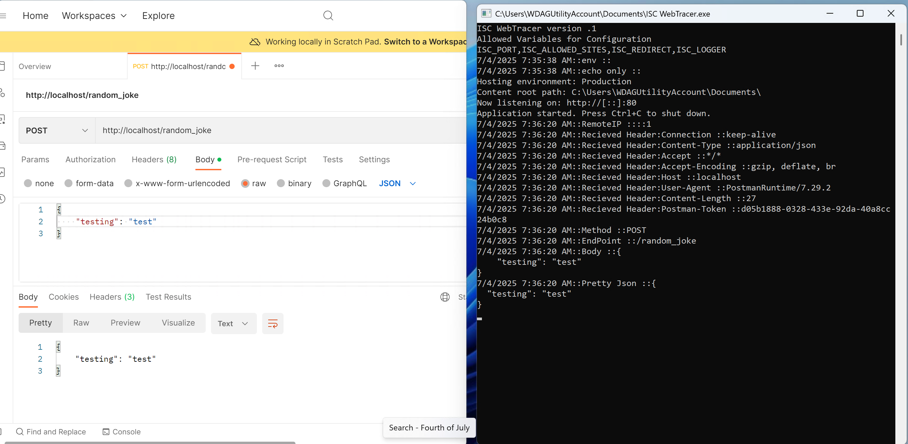
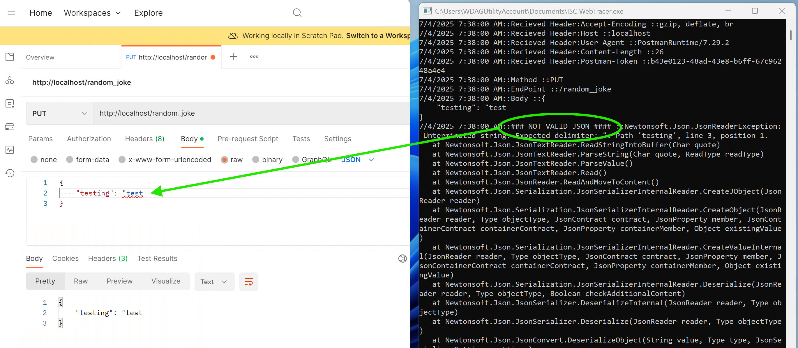
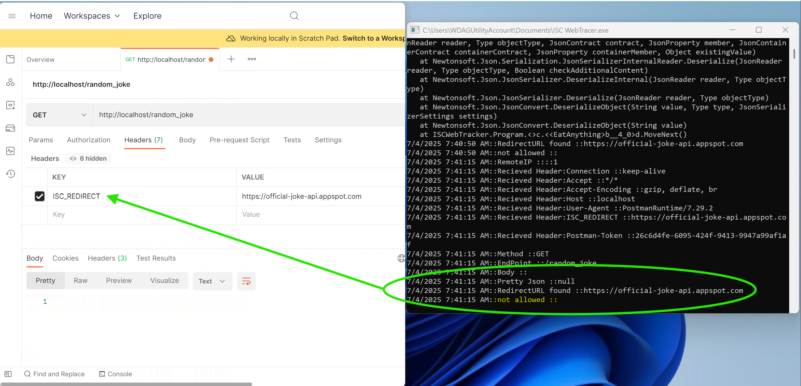
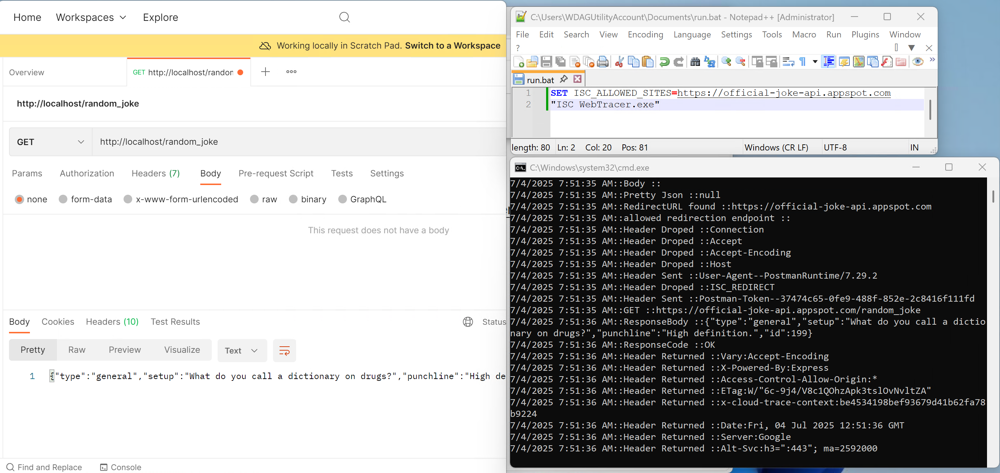

# ISC-WebTracer
Identity Security Cloud tool to make WebApps easer to troubleshoot.

Reading the ccg.log is a great place to start but sometimes finding an error in the payload you are sending or receiving can sometimes be problematic.  If you can use postman to find the gaps you can use this proxy to help you find the gap in what is happening.  

This proxy can also be used to validate a create or delete payload before you hit the target.  This is helpful when some applications targets don’t allow you to delete accounts once created. 

> Info: This is *not* for production its for development and testing.  This proxy is printing everything to your logs for troubleshooting only.  

* ISC_PORT = Port to run proxy webserver on (Example:8080)
* ISC_ALLOWED_SITES = If you want the system to forward request add this variable with the host you will allow the system to redirect to
* ISC_REDIRECT = Add this header to your webservice.  This will let the proxy know that you want to send the data received to the target.  
* ISC_LOGGER = Proxy will just print to the console.  If you want to write to ./trace.log  in tab delimited format, set this value to TRACE

# Using Locally
Normal print Results

Show Missing quote in a json

# With Redirect allowed
Use with care and make sure the container or application is protected

Redirect when ISC_REDIRECT header is not set correctly

Full redirect processed

